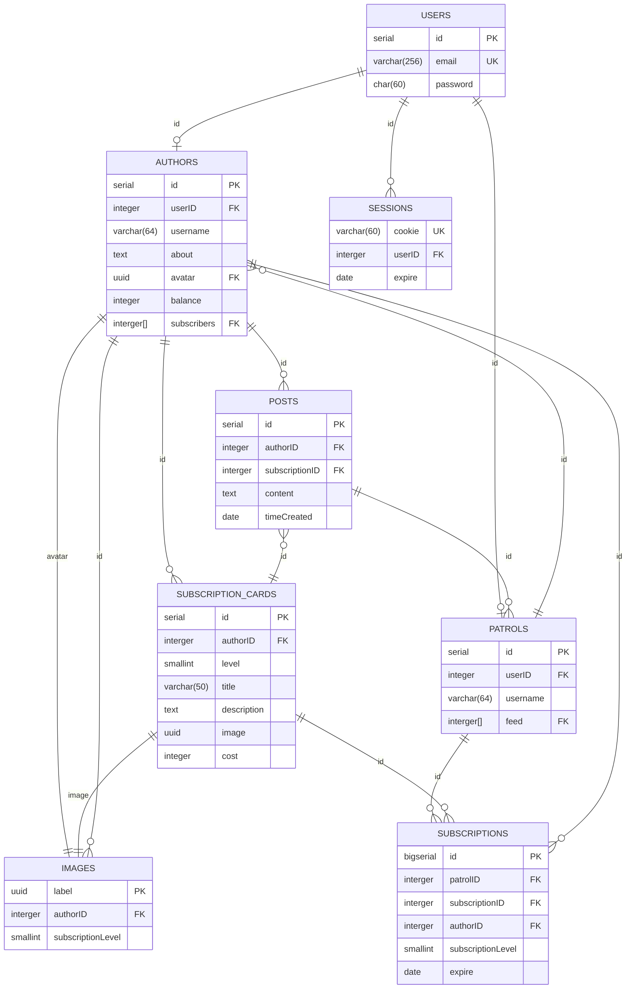
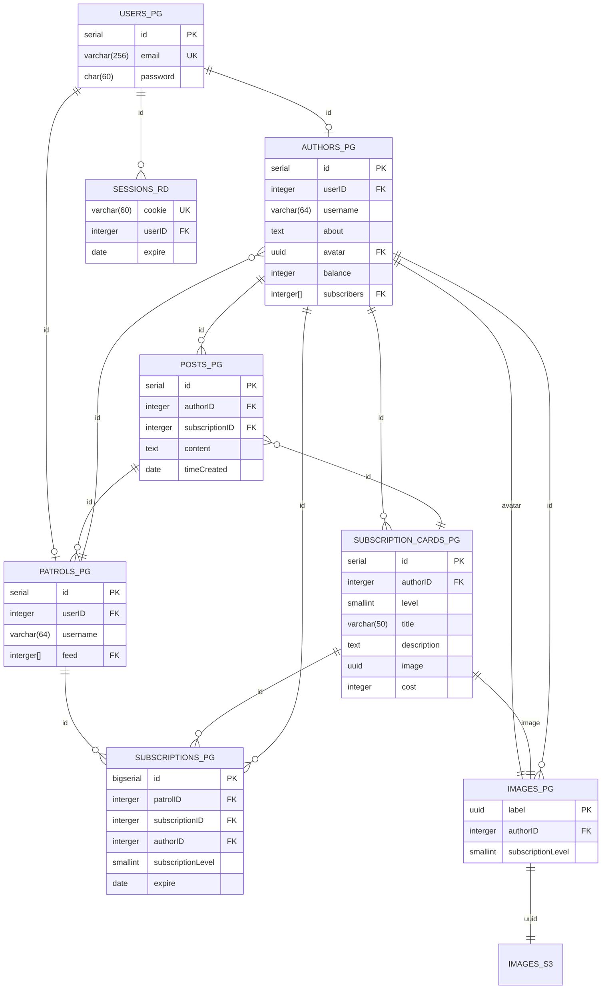
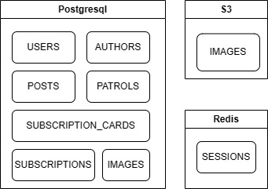
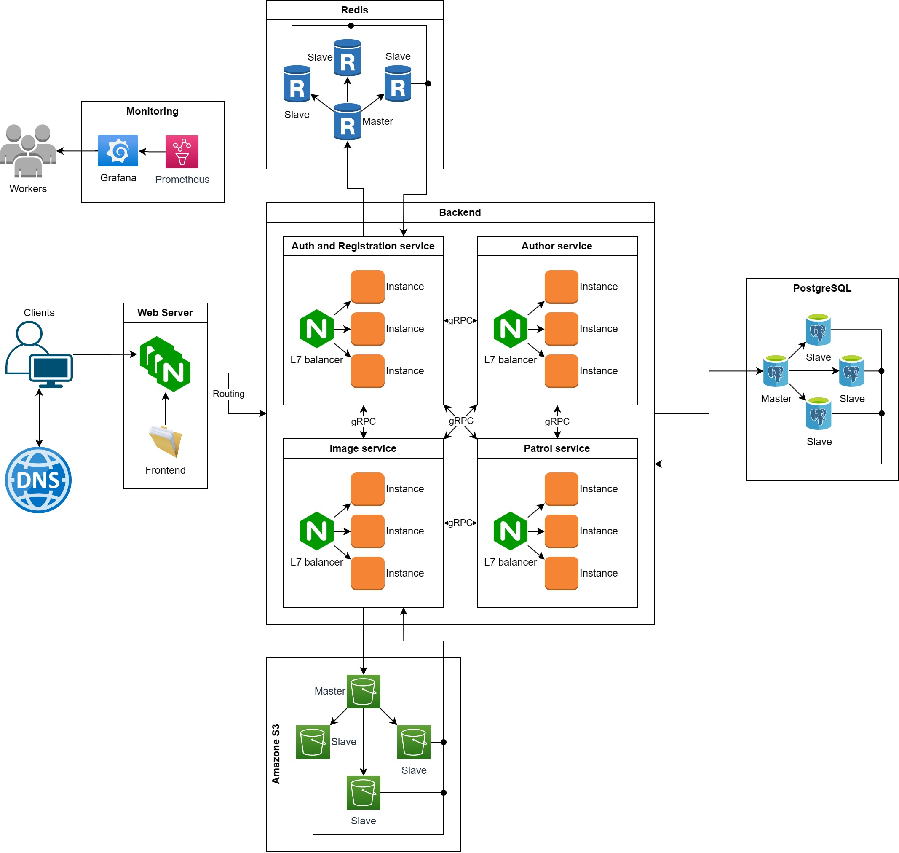

# Patreon
[Методические указания](https://github.com/init/highload/blob/main/homework_architecture.md)
## 1.1 Тема
**Patreon** - краудфандинговая платформа, где пользователи делятся на *Авторов* и *Покровителей*. Авторы публикуют свой творческий контент/материалы, ограничивая доступ к нему с помощью подписок различных уровней. Покровители платят за получение какого-то уровня доступа к материалам автора на определенный срок. Материал может быть как обычный *текст*, так и *видео* или *аудио* контент, *подкасты*, *изображения*, *комиксы*.
### MVP
1. Профиль автора и покровителя.
2. Создание уровней подписок автором.
3. Публикация постов автором с установкой уровня доступа.
4. Хранение контента с ограничением доступа по наличию необходимой подписки.
5. Оплата помесячной подписки со стороны покровителя.
6. Вывод заработанных средств со сторони автора.
## 1.2 Целевая аудитория
- 6.2М активных пользователей в месяц [^1]
- 6М активных покровителей в последнем месяце [^2]
- 250К активных авторов, 220K из них поддерживает хотя бы 1 покровитель [^3]
- Распределение аудитории по континетам: [^1]

  | Страна                  | Процент | Посетителей в месяц |
  | ----------------------- | :-----: | :-----------------: |
  | North and South America |   50%   |        3.1M         |
  | Europe                  |  28.5%  |       1.767М        |
  | Asia                    |  11.5%  |        713K         |
  | Other                   |   10%   |        620K         |

- Распределение авторов по основным тематикам контента [^3]

  | Жанр                         | Кол-во авторов (мин. 1 покровитель) |
  | ---------------------------- | :---------------------------------: |
  | Видео                        |                 62K                 |
  | Подкасты                     |                 18K                 |
  | Музыка                       |                 15K                 |
  | Игры                         |                 20K                 |
  | Текст                        |                 14K                 |
  | Комиксы, рисунки, фотографии |                 40K                 |
  | Остальное                    |                 51K                 |

## 2. Расчет нагрузки
### 2.1 Продуктовые метрики
#### 2.1.1 Аудитория
В виду отсуствия информации о дневной аудитории сервиса Patreon оценим её на основе всеобщей средней частоте использования социальных сетей [^7]
> (70 + 56 +56 + 54 + 46 ) / 5 = 57.6% - процент пользователей, посещающий соц. сеть хотя бы раз в день

| Аудитория |        Общая         | Авторы | Покровители |
| --------- | :------------------: | :----: | :---------: |
| Месячная  |         6.2М         |  250К  |     6M      |
| Дневная   | 6.2M * 0.576 = 3.57М |  144К  |   3.456М    |
#### 2.1.2 Среднее количество действий пользователя в день
#### 2.1.2.1 Общее
- Авторизация:

  Пользователь вынужден авторизовываться на сервисе в нескольких случаях: протухание авторизационной куки, смена пароля или вход с другого устройства. Рекомендавно менять пароль раз в 90 дней [^5]. К этой частоте и привяжем частоту авторизации. Также учтем, что человек заходит минимум с двух уствойств (ПК + телефон).
  > (1/90) * 2 = 0.02 авторизаций в день от одного пользователя

- Регистрация:

  Число регистрация примем равным числу увеличения аудитории сервиса за последний год. По данным [^3] число авторов увеличилось на 6.3%. В источнике [^2] сказано, что с 2017 по 2020 число покровителей увеличилост на 4М, откуда следует, что за год число покровителей увеличивается на 1 млн
  > (250K * 0.063 + 1M) / 365 ~ 2 740 регистраций в день на весь сервис

#### 2.1.2.2 Автор
- Публикация поста:

  Информации о количестве постов нет, поэтому оценим исходя из частоты платного продвижения постов (как правило, продвижение поста связано с его публикацией, поэтому в общем случаи эти частоты соизмеримы). Из источника [^4] получаем статистику по частоте продвижению (Never равномерно распределим по всем частотам). По полученным данным найдем мат. ожидания частоты продвижения (публикации) поста в разрезе на 1 год:
  > (365 * 7.75 + 52 \* 2.5 * 18.05 + 52 * 18.55 + 12 * 2.5 * 21.75 + 12 * 15.15 + 5 * 9.15 + 2.4 * 3.75 + 1 * 5.85)/100 = 70.3475 постов в год
  >
  > 70.3475 / 365 ~ 0.2 постов в день от одного автора

- Вывод средств:

  Будем считать, что автор выводит средства раз в месяц.
  > 1 / 30 = 0.033

- Получение картинки (не из статики):

  Будем считать, что в среднем в каждом посте по 1.5 картинки. Автор при входе на свою страничку прогрузит свою ленту на 10 постов. Следовательно, в день автор запросит:
  > 1.5 * 10 = 15

#### 2.1.2.2 Покровитель
- Оплата подписки:

  Будем считать, что оплата доступна только помесячная. Тогда количество оплат в день будет зависить только от количеств подписок. Из источника [^6] можно получить среднюю цену одной подписки в месяц (примем 3.78$), а из источника [^3] можно получить месячную выплату от всех покровителей. Тогда из расчета на 6М покровителей, получим количество подписок у одного покровителя.
  > Число оплачиваемых подписок у одного покровителя ((25 668 645$ / 6M) / 3.85$) = 1.11
  >
  > 1.11 / 30 = 0.037

- Просмотр ленты и страницы автора:

  Из источника [^1] возьмем, что в среднем в день посещается 2 страницы за 10 минут. Таким образом можнос делать вывод, что пользователь успевает посмотреть 1 раз ленту и 1-ну страницу автора по 10 постов на каждой.

- Получение картинки (не из статики):

  Будем считать, что в среднем в каждом посте по 1.5 картинки. При входе пользователь также запросит аватарки авторов и картинки с профиля автора, которого посетит (картинки с описания (1.5 штуки) и подписок (5 штук)) Следовательно, в день покровитель запросит:
  > 1.5 * 20 + 1.11 + 1.5 + 5 = 37.61

| Тип действия            |  Действий в сутки от одного пользователя  |
| ----------------------- | :---------------------------------------: |
|                         |                   Общее                   |
| Авторизация             |                   0.02                    |
| Регистрация             | 2 740 пользователей в день на весь сервис |
|                         |                   Автор                   |
| Публикация поста        |                    0.2                    |
| Вывод средств           |                   0.033                   |
| Получение картинки      |                    15                     |
|                         |                Покровитель                |
| Оплата подписки         |                   0.037                   |
| Просмотр ленты          |                     1                     |
| Просмотр профиля автора |                     1                     |
| Получение картинки      |                   37.61                   |

#### 2.1.3 Средний размер хранилища пользователя
- Размер профиля (Пользователь)

  | Поле                     | Размер (max) | Размер (average) |
  | ------------------------ | :----------: | :--------------: |
  | Id                       |   4 байта    |     4 байта      |
  | Хешированный пароль (bf) |   60 байта   |     60 байт      |
  | Почтовый адрес           |  254 байта   |     127 байт     |
  > Итог: 191 байт

- Размер профиля (Покровитель) \
  Для покровителя буде генерировать ленту при добавлении поста автором, но которого подписан покровитель. Причем сгенерированная лента будет представлять из себя массив ID-шников постов. Тогда средний размер ленты будет складываться из частоты публикации автором постов и числа подписок у покровителя. Оба значения были посчитаны ранее. Чтобы предостеречь разрастаение этого поля, ограничимся длиной ленты в 3 года.
  > ((0.2 * 365) * 1.1) * 3 ~ 241 пост в ленте у пользователя \
  > 241 * 4 байта = 964 байта - занимает хранение поля ленты у пользователя

  | Поле                   | Размер (max) | Размер (average) |
  | ---------------------- | :----------: | :--------------: |
  | Id                     |   4 байта    |     4 байта      |
  | Псевдоним (64 символа) |   64 байт    |     32 байт      |
  | Лента (массив ID)      |   964 байт   |     964 байт     |
  > Итог: ~ 1000 байт

- Размер профиля (Автор)

  | Поле                              | Размер (max) | Размер (average) |
  | --------------------------------- | :----------: | :--------------: |
  | Псевдоним (64 символа)            |   64 байт    |     32 байт      |
  | Описание (1000 символов)          |  1000 байт   |     500 байт     |
  | Вложения в описание (Изображения) |    512 Мб    |      20 Мб       |
  | Аватар                            |    10 Мб     |       5 Мб       |
  | Баланс                            |   4 байта    |     4 байта      |
  > Итог: ~ 25 Мб

- Размер подписки

  | Поле                    | Размер (max) | Размер (average) |
  | ----------------------- | :----------: | :--------------: |
  | Id                      |   4 байта    |     4 байта      |
  | Уровень                 |    2 байт    |      2 байт      |
  | Заголовок (50 символов) |   50 байт    |     25 байт      |
  | Описание (500 символов) |   500 байт   |     300 байт     |
  | Вложения (Изображения)  |    512 Мб    |       5 Мб       |
  | Стоимость               |   4 байта    |     4 байта      |

  Пусть среднее число подписок у автора - 5 штук.
  > Итог: ~ 25 Мб

- Размер поста

  | Поле                           | Размер (max) | Размер (average) |
  | ------------------------------ | :----------: | :--------------: |
  | Id                             |   4 байта    |     4 байта      |
  | Заголовок (100 символов)       |   100 байт   |     50 байт      |
  | Основной текст (3000 символов) |  3000 байт   |    1500 байт     |
  | Вложения (Изображения)         |    512 МБ    |      20 Мб       |
  | Уровень доступа                |    1 байт    |      1 байт      |
  > Размер поста: ~ 20 Мб

  Информации о количестве постов нет, поэтому посчитаем примерное число постов с 2019 года [^3].
  > Число постов: (0.2 * 365) * (136 000 + 185 000 + 212 000 + 220 000) = **54 969 000**
  >
  > Среднее число постов на 1 автора: 54 969 000 / 220 000 ~ 250
  >
  > Итог: 250 * 20 Мб ~ 4.88 Гб

| Хранилище   | Средний размер |
| ----------- | :------------: |
| Покрователь |     1.1 Кб     |
| Автор       |    4.93 Гб     |

### 2.2 Технические мерики
#### 2.2.1 Хранилище

- Хранение изображений:
  > 54 969 000 * 20 Мб + 250 000 * (5 + 25) Мб = 1.03 Пб

- Хранение постов (без вложений):
  > 54 969 000 * (4 + 50 + 1500 + 1) байт = 79.6 Гб

- Хранение покровителей:
  > 6М * 1.1 Кб ~ 6.3 Гб

| Хранилице             | Размер  |
| --------------------- | :-----: |
| Изображений           | 1.03 Пб |
| Постов (без вложений) | 79.6 Гб |
| Профилей покровителей | 6.3 Гб  |

#### 2.2.2 Сетевой трафик
Возьмем 3 наиболее частых запроса из продуктовых метрик: Просмотр ленты, Публикация поста и Оплата.
За пиковый трафик примем увеличение в 2 раза.
- Просмотр ленты:\
  Будем считать, что при просмотре ленты показываются поледние 10 постов
  > Пиковый: 2 * 3.456M * 1 * 10 * 20 Мб / 86400 с = 125 Гбит/с
  >
  > Суточный: 3.456М * 1 * 10 * 20 Мб = 659.18 Тб/сутки

- Просмотр страницы автора:\
  Будем считать, что при просмотре страницы автора показываются последние 10 постов + все доступные подписки + профиль автора
  > Пиковый: 2 * 3.456M * 1 * (10 * 20 Мб + 25 Мб + 25 Мб) / 86400 с = 156.25 Гбит/с
  >
  > Суточный: 3.456M * 1 * (10 * 20 Мб + 25 Мб + 25 Мб) = 823.97 Тб/сутки

- Публикация поста:
  > Пиковый: 2 * 144K * 0.2 * 20 Мб / 86400 с ~ 0.1 Гбит/с
  >
  > Суточный: 144K * 0.2 * 20 Мб = 562.5 Гб/сутки

- Оплата:
  Примем, что для оплаты нужно отправить данные размером 1 Кб
  > Пиковый: 2 * 3.456M * 0.037 * 1 Кб / 86400 с = 23.68 Кбит/с
  >
  > Суточный: 3.456M * 0.037 * 1 Кб ~  124.88 Мб/сутки

| Тип запроса              | Пиковое потребление в теченнии суток | Суммарный суточный |
| ------------------------ | ------------------------------------ | ------------------ |
| Проcмотр ленты           | 125 Гбит/с                           | 659.18 Тб/сутки    |
| Проcмотр страницы автора | 156.25 Гбит/с                        | 823.97 Тб/сутки    |
| Публикация поста         | 0.1 Гбит/с                           | 562.5 Гб/сутки     |
| Оплата                   | 23.68 Кбит/с                         | 124.88 Мб/сутки    |
| Итог                     | 281.35 Гбит/с                        | 1484 Тб/сутки      |

#### 2.2.3 RPS
За пиковый трафик примем увеличение в 2 раза.

#### 2.2.3.1 Общее
- Авторизация
  > 3.57М * 0.02 / 86400 ~ 0.83 RPS
- Регистрация
  > 2 740 / 86400 ~ 0.032 RPS
- Получение картинки (не статические)
  > (3.456M * 37.61 + 144К * 15) / 86400 ~ 1530 RPS
#### 2.2.3.2 Автор
- Публикация поста:
  > 144K * 0.2 / 86400 ~ 0.33 RPS
- Вывод средств
  > 144K * 0.033 / 86400 ~ 0.0055 RPS
#### 2.2.3.3 Покровитель
- Просмотр ленты:
  > 3.57M * 1 / 86400 ~ 41.32 RPS
- Просмотр страницы автора:
  > 3.57M * 1 / 86400 ~ 41.32 RPS
- Оплата:
  > 3.57M * 0.037 / 86400 ~ 1.53 RPS

| Тип запроса              |  RPS   | Пиковый RPS |
| ------------------------ | :----: | :---------: |
| Авторизация              |  0.83  |    1.66     |
| Регистрация              | 0.032  |    0.064    |
| Публикация поста         |  0.33  |    0.66     |
| Вывод средств            | 0.0055 |    0.011    |
| Просмотр ленты           | 41.32  |    82.64    |
| Просмотр страницы автора | 41.32  |    82.64    |
| Оплата                   |  1.53  |    3.06     |
| Получение картинки       |  1530  |    3060     |
| Итог                     |  1615  |    3230     |

## 3. Логическая схема

### 3.1 Описание
1. Таблица **USER** хранит основные данные всех пользователей сервиса.
2. Таблица **SESSION** служит для хранение всех текущих сессий пользователей из таблицы **USER**.
3. Таблица **PATROLS** хранит данные всех покровителей.
4. Таблица **AUTHORS** хранит данные всех авторов.
5. Таблица **POSTS** хранит все посты и связана с **AUTHORS** и **SUBSCRIPTION_CARDS**. Поле **subscriptionID** может быть **NULL**, что будет значить, что пост доступен без подписи.
6. Таблица **SUBSCRIPTION_CARDS** хранит все подписки. каждая подписка принадлежит какому-то автору (**AUTHORS**).
7. Таблица **SUBSCRIPTIONS** организовывает связь многие ко многим между покровителями и подписками авторов. Также хранит дату окончания подписки.
8. Таблицы **IMAGES** хранит uuid изображения, по которому его можно получить, id автора, которому принадлежит картинка, и уровень подписки, который необходим для получения изображения. Поле **subscriptionLevel** может быть **NULL**, что будет значить, что изображения доступен без подписи (для аватарок, изображений с описаний, подписок и общедоступных постов).

## 4. Физическая схема
> _PG - PostgreSQL \
> _S3 - S3 объектное хранилище \
> _RD - Redis

### 4.1 Индексы
1. Индексы на все первичные ключи (по умолчанию).
2. B-tree Индексирование поля **username** в таблице **AUTHORS** для более быстрого поиска по имени.
3. B-tree Индексирование полей **authorID** и **timeCreated** в таблице **POSTS** для ускорения выборки постов в отсортированном по дате создания виде.
4. Хэш Индексирование поля **email** в таблице **USERS** для быстрого поиска по почте при авторизации.
5. B-tree Индексирование полей **patrolID** и **authorID** в таблице **SUBSCRIPTIONS** для ускорения получения подписок отдельных покровителей и получения подписки отдельного покровителя к конкретному автору.
### 4.2 Репликация
Репкликация всеx баз данных по схеме 1 Master - 3 Slave.
### 4.3 Описание
Основная чаcть данных хранится на сервере Postgresql. Также в Postgres организована репликацию данных на 3 реплики.\
Redis используется для хранение текущих сессий. Она хранит данные о текущих сессиях в RAM для быстрого доступа к ним и также реплицируется.\
Для хранения картинок используется S3 хранилище. Однако доступ картинкам доступен только через микросервис, которые сперва должен проверить, доступна ли картанка для пользователя, от которого пришел запрос. Также реплицируется.
#### 4.4.1 Получение ленты
Лента формируется при добавлении поста автором. При добавлении поста, всем подписчикам автора (поле subcribers) добавляется id нового поста в поле feed. Таким образом при запросе на получение ленты необходимо будет только выполнить запрос по получению постов по id из 10 последних элементов массива feed. Однако ограничим длину ленты в 240 постов, чтобы предостеречь разрастание поля. Получение ленты сверх этого числа будут медленнее, но и так глубоко ленту листают не часто.
#### 4.4.2 Получение страницы автора
При просмотре страницы автора выгружается не только данные автора, но и его посты. Для ускорения этого запроса добавлен индекс 3, который за счет структуры b-tree уже будет иметь сортированный вид.
## 5. Технологии
| Технология | Область примерения | Мотивационная часть                                                                                                                      |
| ---------- | ------------------ | ---------------------------------------------------------------------------------------------------------------------------------------- |
| Typescript | Frontend           | Добавляет статическую типизацию, что позволяет выявлять ошибки на этапе компиляции проекта                                               |
| React      | Frontend           | Ускоряет разработку.                                                                                                                     |
| PWA        | Frontend           | Позволяет устанавливать веб страницу как приложение, что изюавить от необходимости разрабатывать отдельное приложение для Android и IOS. |
| Go         | Backend            | Имеет многопоточность из коробки, простой синтаксис на ряду с высокой производительностью.                                               |
| PostgreSQL | Backend            | Реляционная СУБД открытого доступа. Множество настроек для оптимизации. Большае комьюнити.                                               |
| Redis      | Backend            | in-memory БД для хранения сессий пользователей. Шардирование и репликация из коробки.                                                    |
| Amazon S3  | Object Storage     | Популярное и надежное хранилище объектов. Предлагает много инструментов для настройки под свой сервис.                                   |
| Nginx      | Web Server         | Один из лучших веб серверос для отдачи статики и L7 балансировки нагрузки.                                                               |
| Prometheus | Monitoring         | Сбор метрик с различных сервисов приложения.                                                                                             |
| Grafana    | Monitoring         | Визуализация данных с Prometheus                                                                                                         |

## 6. Схема проекта

### 6.1 Описание
Проект имеет несколько частей:
1. WebServer - 3 сервера Nginx для распределения и отказоустойчивости точки входа клиентских запросов.
2. Backend - микросервисная архитектура, внутри каждого микросервиса также имеется по 3 инстанса для поддержки отказоустойчивости:
   1. Auth and Registration service - сервис авторизации и регистрации. Обращается в Redis для создания/подтверждения сессии и в Postgres для созадния новго пользователя.
   2. Author service - сервис функциональности автора
   3. Patrol service - сервис функциональности покровителя
   4. Image service - сервис для отдачи картинок. Так доступ к картинкам доступен только по уровням подписки, то прежде чем отдать статические картинки с S3 хранилища, проверяется наличие подписки у клиента через его куки.
3. Redis, PostgreSQL, AmazonS3 - базы данных, доступ только из внутреней сети.
4. Monitoring - Prometheus собирает метрики со всех микросервисов, баз данных и nginx для отображения на дашбордах в Grafana.
#### 6.1.1 Путь данных
1. Клиент резовит имя домена в IP адрес.
2. По IP адресу клиент попадает в один из nginx-серверов, который:
   1. Отдает ему фронтенд статику
   2. Отдает кэш
   3. Роутит запрос на микросервис
3. При распределении внутри микросервиса работает L7 балансировка, которая отправляет запрос на один из инстансов сервиса.
4. Микросервис при необходимости может:
   1. Обратиться к другому микросевису по gRPC
   2. Обраться к PosgreSQL
   3. Обраться S3 хранилищу (только сервис Image)
   4. Обатиться к Redis (только сервис Auth and Registration)
5. Запись в любую БД осуществляется через Master, а чтение из Slave реплики.
6. При запросе на получение картинки (не статика из фронта) Image cервис обращается в сервис авторизации для получения ID клиента, а затем сравнивает в таблицах Postgres, какой уровень ограничения выставлен для запрашиваемой картинки и есть ли у клиента необходимый уровень.
7. Ответ возвращается клиенту.
#### 6.1.2 Балансировка
Балансировка осуществляется на нескольких уровнях:
1. Внешняя DNS балансировка
2. Внутренний роутинг запросов по микросервисам
3. Внутренняя L7 балансировка (в микросервисах)
## 7. Список серверов
| Наименование         | Значение      |
| -------------------- | ------------- |
| RPS                  | 1615 запрос/с |
| Пиковый RPS          | 3230 запрос/с |
| Пиковый трафик       | 281.35 Гбит/с |
| Суммарный суточный   | 1484 Тб/сутки |
| Изображения          | 1.03 Пб       |
| Посты (без вложений) | 79.6 Гб       |

### 7.1. Nginx (WebServer)
Согласно бенчмарку [^8] RPS на проекте небольшой поэтому достаточно будет и 2х ядер. Необходимо поддержать трафик в 281 Гбит/с, этому возьмем 3 сервера с сетевыми карточками в 100 Гбит/с. Нагрузка на кэшироавние также небольшая, поэтому должно хватить 64Гб RAM.
### 7.1. Nginx (L7 balancer)
Данные сервера служат только для балансировки нагрузки, поэтому хватит минимальной конфигурации. Исключением будет балансировщих для Image сервиса, где необходимо поставить увеличить производительность.
### 7.1. Services
Все сервисы также имеют невысокий RPS, поэтому конфигурируются минимально. Исключением будет Image сервис, где необходимо поставить увеличить производительность.
### 7.1. Redis
Redis должен умещать в себе сессии 6.2М пользователей на нескольких устройствах в RAM. Поэтому тут необходимо увеличить RAM до 64Гб.
### 7.1. PostgreSQL
Размер данных небольшой, поэтому вполне уместить все таблицы и индексы в RAM.

| Имя                           | Кол-во | Ядер | RAM, Гб | Диск, Гб | Сеть, Гбит/с |
| ----------------------------- | ------ | ---- | ------- | -------- | ------------ |
| Nginx (WebServer)             | 3      | 2    | 64      | 30       | 100          |
| Nginx (L7 balancer)           | 3      | 1    | 16      | 30       | 10           |
| Nginx (L7 balancer for Image) | 1      | 2    | 24      | 30       | 100          |
| Auth and Registration service | 3      | 2    | 16      | 30       | 10           |
| Author service                | 3      | 2    | 16      | 30       | 10           |
| Patrol service                | 3      | 2    | 16      | 30       | 10           |
| Image service                 | 3      | 4    | 16      | 30       | 100          |
| Redis                         | 4      | 4    | 64      | 30       | 10           |
| PostgreSQL                    | 4      | 8    | 256     | 500      | 10           |
| Amazon S3                     | 4      | -    | -       | -        | -            |

## Список литературы
[^1]: [Domain Overview:
patreon.com](https://www.semrush.com/analytics/overview/?q=patreon.com&searchType=domain)

[^2]: [PATREON STATISTICS 2023: USERS, REVENUE & MARKET SHARE](https://earthweb.com/patreon-statistics/)

[^3]: [Patreon Statistics](https://graphtreon.com/patreon-stats)

[^4]: [The first-ever Patreon Creator Census](https://blog.patreon.com/en-GB/the-first-ever-patreon-creator-census)

[^5]: [How Often Should You Change Your Passwords?](https://www.keepersecurity.com/blog/2020/12/21/how-often-should-you-change-your-password-keeper-security/)

[^6]: [Tearing Down Patreon's Pricing](https://www.profitwell.com/recur/all/patreon-pricing-page-teardown)

[^7]: [Social Media Use in 2021](https://www.pewresearch.org/internet/2021/04/07/social-media-use-in-2021/#a-majority-of-facebook-snapchat-and-instagram-users-say-they-visit-these-platforms-on-a-daily-basis)

[^8]: [Testing the Performance of NGINX and NGINX Plus Web Servers](https://www.nginx.com/blog/testing-the-performance-of-nginx-and-nginx-plus-web-servers/)
<!-- []:  -->
