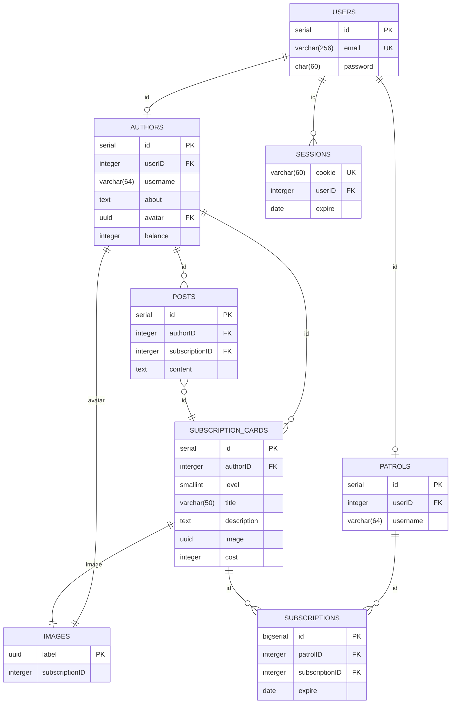
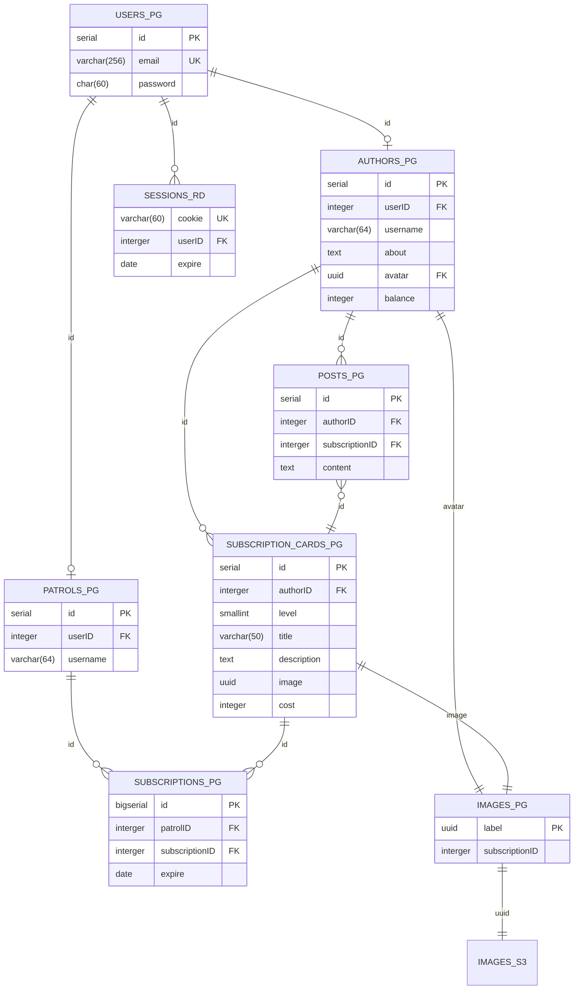

# Patreon
[Методические указания](https://github.com/init/highload/blob/main/homework_architecture.md)
## 1.1 Тема
**Patreon** - краудфандинговая платформа, где пользователи делятся на *Авторов* и *Покровителей*. Авторы публикуют свой творческий контент/материалы, ограничивая доступ к нему с помощью подписок различных уровней. Покровители платят за получение какого-то уровня доступа к материалам автора на определенный срок. Материал может быть как обычный *текст*, так и *видео* или *аудио* контент, *подкасты*, *изображения*, *комиксы*.
### MVP
1. Профиль автора и покровителя.
2. Создание уровней подписок автором.
3. Публикация постов автором с установкой уровня доступа.
4. Хранение контента с ограничением доступа по наличию необходимой подписки.
5. Оплата помесячной подписки со стороны покровителя.
6. Вывод заработанных средств со сторони автора.
## 1.2 Целевая аудитория
- 6.2М активных пользователей в месяц [^1]
- 6М активных покровителей в последнем месяце [^2]
- 250К активных авторов, 220K из них поддерживает хотя бы 1 покровитель [^3]
- Распределение аудитории по континетам: [^1]

| Страна                  | Процент | Посетителей в месяц |
| ----------------------- | :-----: | :-----------------: |
| North and South America |   50%   |        3.1M         |
| Europe                  |  28.5%  |       1.767М        |
| Asia                    |  11.5%  |        713K         |
| Other                   |   10%   |        620K         |

- Распределение авторов по основным тематикам контента [^3]

| Жанр                         | Кол-во авторов (мин. 1 покровитель) |
| ---------------------------- | :---------------------------------: |
| Видео                        |                 62K                 |
| Подкасты                     |                 18K                 |
| Музыка                       |                 15K                 |
| Игры                         |                 20K                 |
| Текст                        |                 14K                 |
| Комиксы, рисунки, фотографии |                 40K                 |
| Остальное                    |                 51K                 |

## 2. Расчет нагрузки
### 2.1 Продуктовые метрики
#### 2.1.1 Аудитория
В виду отсуствия информации о дневной аудитории сервиса Patreon оценим её на основе всеобщей средней частоте использования социальных сетей [^7]
> (70 + 56 +56 + 54 + 46 ) / 5 = 57.6% - процент пользователей, посещающий соц. сеть хотя бы раз в день

| Аудитория |        Общая         | Авторы | Покровители |
| --------- | :------------------: | :----: | :---------: |
| Месячная  |         6.2М         |  250К  |     6M      |
| Дневная   | 6.2M * 0.576 = 3.57М |  144К  |   3.456М    |
#### 2.1.2 Среднее количество действий пользователя в день
#### 2.1.2.1 Общее
- Авторизация:

Пользователь вынужден авторизовываться на сервисе в нескольких случаях: протухание авторизационной куки, смена пароля или вход с другого устройства. Рекомендавно менять пароль раз в 90 дней [^5]. К этой частоте и привяжем частоту авторизации. Также учтем, что человек заходит минимум с двух уствойств (ПК + телефон).
> (1/90) * 2 = 0.02 авторизаций в день от одного пользователя

- Регистрация:

Число регистрация примем равным числу увеличения аудитории сервиса за последний год [^3]. Так как по увеличению аудтории покровителей данных нет, то примем, что число покровителей увеличилось на такойже процент.
> (250K * 0.057 + 6M * 0.057) / 365 ~ 970 регистраций в день на весь сервис

#### 2.1.2.2 Автор
- Публикация поста:

Информации о количестве постов нет, поэтому оценим исходя из частоты платного продвижения постов (как правило, продвижение поста связано с его публикацией, поэтому в общем случаи эти частоты соизмеримы). Из источника [^4] получаем статистику по частоте продвижению (Never равномерно распределим по всем частотам). По полученным данным найдем мат. ожидания частоты продвижения (публикации) поста в разрезе на 1 год:
> (365 * 7.75 + 52 \* 2.5 * 18.05 + 52 * 18.55 + 12 * 2.5 * 21.75 + 12 * 15.15 + 5 * 9.15 + 2.4 * 3.75 + 1 * 5.85)/100 = 70.3475 постов в год
>
> 70.3475 / 365 ~ 0.2 постов в день от одного автора

- Вывод средств:

Будем считать, что автор выводит средства раз в месяц.
> 1 / 30 = 0.033

#### 2.1.2.2 Покровитель
- Оплата подписки:

Будем считать, что оплата доступна только помесячная. Тогда количество оплат в день будет зависить только от количеств подписок. Из источника [^6] можно получить среднюю цену одной подписки в месяц, а из источника [^3] можно получить месячную выплату от всех покровителей. Тогда из расчета на 6М покровителей, получим количество подписок у одного покровителя.
> Число оплачиваемых подписок у одного покровителя ((25 668 645 / 6M) / 4.5) = 0.95
>
> 0.95 / 30 = 0.032

- Просмотр ленты и страницы автора:

Из источника [^1] возьмем, что в среднем в день посещается 2 страницы за 10 минут. Таким образом можнос делать вывод, что пользователь успевает постмотреть 1 раз ленту и 1-ну страницу автора.

| Тип действия            | Действий в сутки от одного пользователя |
| ----------------------- | :-------------------------------------: |
|                         |                  Общее                  |
| Авторизация             |                  0.02                   |
| Регистрация             | 970 пользователей в день на весь сервис |
|                         |                  Автор                  |
| Публикация поста        |                   0.2                   |
| Вывод средств           |                  0.033                  |
|                         |               Покровитель               |
| Оплата подписки         |                  0.032                  |
| Просмотр ленты          |                    1                    |
| Просмотр профиля автора |                    1                    |

#### 2.1.3 Средний размер хранилища пользователя
- Размер профиля (Покровитель)

| Поле                     | Размер (max) | Размер (average) |
| ------------------------ | :----------: | :--------------: |
| Id                       |   4 байта    |     4 байта      |
| Псевдоним (64 символа)   |   64 байт    |     32 байт      |
| Хешированный пароль (bf) |   60 байта   |     60 байт      |
| Почтовый адрес           |  254 байта   |     127 байт     |
> Итог: 223 байт

- Размер профиля (Автор)

| Поле                              | Размер (max) | Размер (average) |
| --------------------------------- | :----------: | :--------------: |
| Описание (1000 символов)          |  1000 байт   |     500 байт     |
| Вложения в описание (Изображения) |    512 Мб    |      20 Мб       |
| Аватар                            |    10 Мб     |       5 Мб       |
| Баланс                            |   4 байта    |     4 байта      |
> Итог: ~ 25 Мб

- Размер подписки

| Поле                    | Размер (max) | Размер (average) |
| ----------------------- | :----------: | :--------------: |
| Id                      |   4 байта    |     4 байта      |
| Уровень                 |    1 байт    |      1 байт      |
| Заголовок (50 символов) |   50 байт    |     25 байт      |
| Описание (500 символов) |   500 байт   |     300 байт     |
| Вложения (Изображения)  |    512 Мб    |       5 Мб       |
| Стоимость               |   4 байта    |     16 байт      |

Пусть среднее число подписок у автора - 5 штук.
> Итог: ~ 25 Мб

- Размер поста

| Поле                           | Размер (max) | Размер (average) |
| ------------------------------ | :----------: | :--------------: |
| Id                             |   4 байта    |     4 байта      |
| Заголовок (100 символов)       |   100 байт   |     50 байт      |
| Основной текст (3000 символов) |  3000 байт   |    1500 байт     |
| Вложения (Изображения)         |    512 МБ    |      20 Мб       |
| Уровень доступа                |    1 байт    |      1 байт      |
> Размер поста: ~ 20 Мб

Информации о количестве постов нет, поэтому посчитаем примерное число постов с 2019 года [^3].
> Число постов: (0.2 * 365) * (136 000 + 185 000 + 212 000 + 220 000) = **54 969 000**
>
> Среднее число постов на 1 автора: 54 969 000 / 220 000 ~ 250
>
> Итог: 250 * 20 Мб ~ 4.88 Гб

| Хранилище   | Средний размер |
| ----------- | :------------: |
| Покрователь |    223 байт    |
| Автор       |    4.93 Гб     |

### 2.2 Технические мерики
#### 2.2.1 Хранилище

- Хранение постов (без вложений):
  > 54 969 000 * (4 + 50 + 1500 + 1) байт = 79.6 Гб

- Хранение изображений:
  > 54 969 000 * 20 Мб + 220 000 * (5 + 25) Мб = 1.029 Пб

#### 2.2.2 Сетевой трафик
Возьмем 3 наиболее частых запроса из продуктовых метрик: Просмотр ленты, Публикация поста и Оплата.
За пиковый трафик примем увеличение в 2 раза.
- Просмотр ленты:\
  Будем считать, что при просмотре ленты показываются поледние 10 постов
  > Пиковый: 2 * 3.456M * 1 * 10 * 20 Мб / 86400 с = 125 Гбит/с
  >
  > Суточный: 3.456М * 1 * 10 * 20 Мб = 659.18 Тб/сутки

- Просмотр страницы автора:\
  Будем считать, что при просмотре страницы автора показываются последние 10 постов + все доступные подписки + профиль автора
  > Пиковый: 2 * 3.456M * 1 * (10 * 20 Мб + 25 Мб + 25 Мб) / 86400 с = 156.25 Гбит/с
  >
  > Суточный: 3.456M * 1 * (10 * 20 Мб + 25 Мб + 25 Мб) = 823.97 Тб/сутки

- Публикация поста:
  > Пиковый: 2 * 144K * 0.2 * 20 Мб / 86400 с ~ 0.1 Гбит/с
  >
  > Суточный: 144K * 0.2 * 20 Мб = 562.5 Гб/сутки

- Оплата:
  Примем, что для оплаты нужно отправить данные размером 1 Кб
  > Пиковый: 2 * 3.456M * 0.032 * 1 Кб / 86400 с = 20.48 Кбит/с
  >
  > Суточный: 3.456M * 0.032 * 1 Кб ~  216 Мб/сутки

| Тип запроса              | Пиковое потребление в теченнии суток | Суммарный суточный |
| ------------------------ | ------------------------------------ | ------------------ |
| Проcмотр ленты           | 125 Гбит/с                           | 659.18 Тб/сутки    |
| Проcмотр страницы автора | 156.25 Гбит/с                        | 823.97 Тб/сутки    |
| Публикация поста         | 0.1 Гбит/с                           | 562.5 Гб/сутки     |
| Оплата                   | 20.48 Кбит/с                         | 216 Мб/сутки       |

#### 2.2.3 RPS
За пиковый трафик примем увеличение в 2 раза.

#### 2.2.3.1 Общее
- Авторизация
  > 3.57М * 0.02 / 86400 ~ 0.83 RPS
- Регистрация
  > 970 / 86400 ~ 0.01 RPS
#### 2.2.3.2 Автор
- Публикация поста:
  > 144K * 0.2 / 86400 ~ 0.33 RPS
- Вывод средств
  > 144K * 0.033 / 86400 ~ 0.0055 RPS
#### 2.2.3.3 Покровитель
- Просмотр ленты:
  > 3.57M * 1 / 86400 ~ 41.32 RPS
- Просмотр страницы автора:
  > 3.57M * 1 / 86400 ~ 41.32 RPS
- Оплата:
  > 3.57M * 0.032 / 86400 ~ 1.32 RPS

| Тип запроса              |  RPS   | Пиковый RPS |
| ------------------------ | :----: | :---------: |
| Авторизация              |  0.83  |    1.66     |
| Регистрация              |  0.01  |    0.02     |
| Публикация поста         |  0.33  |    0.66     |
| Вывод средств            | 0.0055 |    0.011    |
| Просмотр ленты           | 41.32  |    82.64    |
| Просмотр страницы автора | 41.32  |    82.64    |
| Оплата                   |  1.32  |    2.64     |

## 3. Логическая схема

### 3.1 Описание
1. Таблица **USER** хранит основные данные всех пользователей сервиса.
2. Таблица **SESSION** служит для хранение всех текущих сессий пользователей из таблицы **USER**.
3. Таблица **PATROLS** хранит данные всех покровителей.
4. Таблица **AUTHORS** хранит данные всех авторов.
5. Таблица **POSTS** хранит все посты и связана с **AUTHORS** и **SUBSCRIPTION_CARDS**. Поле **subscriptionID** может быть **NULL**, что будет значить, что пост доступен без подписи.
6. Таблица **SUBSCRIPTION_CARDS** хранит все подписки. каждая подписка принадлежит какому-то автору (**AUTHORS**).
7. Таблица **SUBSCRIPTIONS** организовывает связь многие ко многим между покровителями и подписками авторов. Также хранит дату окончания подписки.
8. Таблицы **IMAGES** хранит uuid изображения, по которому его можно получить, и уровень подписки, который необходим для получения изображения. Поле **subscriptionID** может быть **NULL**, что будет значить, что изображения доступен без подписи (для аватарок, изображений с описаний и подписок и общедоступных постов).

## 4. Физическая схема
> _PG - PostgreSQL \
> _S3 - S3 объектное хранилище \
> _RD - Redis

### 4.1 Индексы
1. Индексы на все первичные ключи (по умолчанию).
2. Индексирование поля **username** в таблице **AUTHORS**.
3. Индексирование поля **authorID** в таблице **POSTS**.
4. Индексирование поля **email** в таблице **USERS**.
5. Индексирование поля **patrolID** в таблице **SUBSCRIPTIONS**.
### 4.2 Шардирование
1. **USERS** - шардирование по хэш функции поля **email**.
2. **PATROLS** - шардирование по хэш функции поля **userID**.
3. **POSTS** - шардирование по хэш функции поля **authorID**.
### 4.3 Репликация
Репкликация всей базв данных Postgres по схеме 1 Master - 2 Slave.
## Список литературы
[^1]: [Domain Overview:
patreon.com](https://www.semrush.com/analytics/overview/?q=patreon.com&searchType=domain)

[^2]: [PATREON STATISTICS 2023: USERS, REVENUE & MARKET SHARE](https://earthweb.com/patreon-statistics/)

[^3]: [Patreon Statistics](https://graphtreon.com/patreon-stats)

[^4]: [The first-ever Patreon Creator Census](https://blog.patreon.com/en-GB/the-first-ever-patreon-creator-census)

[^5]: [How Often Should You Change Your Passwords?](https://www.keepersecurity.com/blog/2020/12/21/how-often-should-you-change-your-password-keeper-security/)

[^6]: [Patreon Creators Statistics](https://graphtreon.com/patreon-creators)

[^7]: [Social Media Use in 2021](https://www.pewresearch.org/internet/2021/04/07/social-media-use-in-2021/#a-majority-of-facebook-snapchat-and-instagram-users-say-they-visit-these-platforms-on-a-daily-basis)

[]: 
